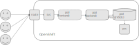

# Lesson 4: Container Logs and Metrics

- [Lesson 4: Container Logs and Metrics](#lesson-4-container-logs-and-metrics)
  - [Logging](#logging)
    - [Containers logging](#containers-logging)
    - [Logging in k8s/OpenShift](#logging-in-k8sopenshift)
  - [Metrics](#metrics)
    - [Container & metrics](#container--metrics)
  - [Microservices Perf&Scale testing](#microservices-perfscale-testing)
    - [Example application](#example-application)
    - [Demo?](#demo)
    - [Expected output from perf&scale tests](#expected-output-from-perfscale-tests)

## Logging

### Containers logging

Things to learn in this section:
- How should containers log and why?
- Where are container logs stored?
- Understand which log drivers are used.

Steps:
- Start container and watch logs
  - `podman run -it -p 8080:8080 --rm --name logtest -t quay.io/rhsacz/ed-app:0.3.0`
- Start Container in background
  - `podman run -d -p 8080:8080 --rm --log-driver k8s-file  --name logtest -t quay.io/rhsacz/ed-app:0.3.0`
- View container logs
  - `podman logs -f logtest`
  - Try also `podman logs --latest`
- Make requests to view logs
  - `curl localhost:8080`
- Check how logs are stored, explore directory
  - Find logs location in `podman inspect --latest| less`
  - View logs in k8s file
    - `tail -f $(podman inspect --latest --format '{{ .HostConfig.LogConfig.Path }}')`

### Logging in k8s/OpenShift

Things to learn in this section:
- How Logging stack in OpenShift Works
- How to deploy logging stack in OpenShift
- How to observe logs of application running in OpenShift

Resources:
- [Presentation](./src/openshift-logging-metrics-presentation.pdf)

Steps:
- Deploy logging stack (instructor walkthrough)
- Deploy and expose application from container image `quay.io/rhsacz/ed-app:0.3.0`
- Open Kibana UI and view application logs

## Metrics

### Container & metrics

Things to learn in this section:
- Prometheus metrics basics
- How to expose Prometheus supported metrics
- Monitoring stack in OpenShift
- Metrics provided by node exporter
- Metrics provided by application

Resources:
- [Prometheus](https://prometheus.io/)
- [Prometheus exposition format](https://prometheus.io/docs/instrumenting/exposition_formats/)
- [Prometheus metrics types](https://prometheus.io/docs/concepts/metric_types/)
- [Presentation](./src/openshift-logging-metrics-presentation.pdf)

Steps:
- Walk through documentation
- Observe metrics exposed by deployed application
- View metrics in Grafana

## Microservices Perf&Scale testing

What is handy to know:

* What is percentile (and histogram and average)
* Sequential vs. parallel
* Throughput vs. latency
* Horizontal vs. vertical scaling
* Understand pod resource **requests** and **limits** (quality of service for testng vs. production settings)

Preparing for testing:

* Do we have knowledge and/or some diagrams on how the application works and how it interacts with the rest of the ecosystem?
* How to deploy the application into non-production environment for the testing?
* What (performance and scale related) risks the application/deployment has?
* What scenario would be testable from a performance point of view?
  * What if you have to pick one, which one?
* Are there some existing perf&scale results?
* What are the perf&scale expectations/projections?

### Example application

How it works:

Name: *Banking-like™ application*

* Manage users and their account balance
* Add money transfer transactions
* Search users by name, address, email…

Technicalities:

* Python backend application in Flask framework with SQLAlchemy as an ORM
* PostgreSQL with just two tables `users` and `moves`
* Gunicorn as an application server

Source code: <https://github.com/jhutar/perfscale-demo-app/blob/main/myapp.py>

Deployment:

Source code: <https://github.com/jhutar/perfscale-demo-app/blob/main/deploy.yaml>

Risks:

* How many concurrent API requests it can handle?
* Is there any difference between read and write operations?
* Will performance drop with more entities in the DB?
* What resources are we going to need to run the application?
* What aspects of the application to monitor?
* Can UI handle the traffic?

Scenario:

We will stick to just one question: concurrent API read access

Locust script to the rescue: <https://github.com/jhutar/perfscale-demo-app/blob/main/testing.py>
Locust is open source load testing tool that allows you to define test scenarios with Python code, and hit tested system with lots of simultaneous users.

Existing results:

None :-)

Expectations:

* In peaks 100 users concurrently
* Plan to grow to 1000 concurrent users next year, double it year after…
* Every user does 3 transactions per day
* Expected latency 99.9th percentile below 100 ms

### Demo?

Deploy the application and testing pod to the cluster (from <https://github.com/jhutar/perfscale-demo-app/> repo directory):

    git clone https://github.com/jhutar/perfscale-demo-app.git
    cd perfscale-demo-app/
    oc -n perfscale-demo-app create -f deploy.yaml

Let's see what pods are being created:

    oc -n perfscale-demo-app get pods

We are not going to test from outside of the cluster (although route is functional,
see command below), because that would introduce another delay to the testing:
our internet connection lag (from my laptop to the cluster).

    oc -n perfscale-demo-app get svc/perfscale-demo-service
    oc -n perfscale-demo-app get route/perfscale-demo-route

Now we generate some fake data to the container using helper in the app itself
and connect to the testing pod so we can run the test from there:

    oc -n perfscale-demo-app get pods
    oc -n perfscale-demo-app exec pod/perfscale-demo-app-... -- flask test-data
    oc -n perfscale-demo-app rsh pod/testing-...

And then, in the "testing-..." pod, run the test script:

    locust --locustfile testing.py --headless --users 10 --spawn-rate 10 -H http://perfscale-demo-service.perfscale-demo-app.svc --run-time 10 --print-stats --only-summary

Would scaling the application horizontally improve RPS?

    oc -n perfscale-demo-app scale --replicas=3 deployment/perfscale-demo-app
    watch oc -n perfscale-demo-app get pods

Would adding more resources to the database pod improve RPS?

    oc -n perfscale-demo-app set resources deployment/postgresql --limits=cpu=500m,memory=512Mi --requests=cpu=500m,memory=512Mi
    watch oc -n perfscale-demo-app get pods

Cleanup:

    oc delete project/perfscale-demo-app

### Expected output from perf&scale tests

* Determine main application performance metrics
  * e.g. API requests per second (RPS) or Kafka throughput or UI performance…
* Look for application specific tunings
  * e.g. does -Xms/-Xmx params for Java applications affect performance…
* Capacity planning testing (how many pods, requests/limits, DB size…) to achieve required performance with minimal resources
  * does it scale vertically and/or horizontally?
* SQL DB usage review
  * e.g. optimal use of indexes and slow queries…
* Find a breaking point
  * e.g. at what concurrency application starts to fail, at what payload size…
