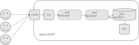

Microservices Perf\&Scale testing
=================================

What is handy to know:

* What is percentile (and histogram and average)
* Sequential vs. parallel
* Throughput vs. latency
* Horizontal vs. vertical scaling
* Understand pod resource **requests** and **limits** (quality of service for testng vs. prod settings)

Preparing for testing:

* Do we have knowledge and/or some diagrams on how the application works and how it interacts with the rest of the ecosystem
* How to deploy the application into non-production environment for the testing
* What (perf and scale related) risks the application/deployment have
* What scenario would be testable from a performance point of view
  * What if you have to pick one, which one?
* Any existing perf&scale results
* What are the perf&scale expectations/projections

Example application
-------------------

How it works:

Name: Banking-like™ application

* Manage users and watch their money balance
* Add money transfer transactions
* Search users by name, address, email…

Technicalities:

* PostgreSQL with just two tables `users` and `moves`
* Python backend application in Flask framework with SQLAlchemy as an ORM
* Gunicorn as an application server

Source code: <https://github.com/jhutar/perfscale-demo-app/blob/main/myapp.py>

Deployment:

Source code: <https://github.com/jhutar/perfscale-demo-app/blob/main/deploy.yaml>

Risks:

* How many API requests it can handle
* Is there a difference in read/write operations
* Will performance drop with more entities in the DB
* What resources are we going to need to run the application
* What aspects of the application to monitor
* Can UI handle the traffic

Scenario:

We will stick to just one question: concurrent API read access

Locust script to the rescue: <https://github.com/jhutar/perfscale-demo-app/blob/main/testing.py>

Existing results:

None :-)

Expectations:

* In peaks 100 users concurrently
* Plan to grow to 1000 concurrent users next year, double it year after…
* Every user does 3 transactions every day
* Expected latency 99.9th percentile below 100 ms

Demo?
-----

Deploy the application and testing pod to the cluster (from <https://github.com/jhutar/perfscale-demo-app/> repo directory):

    oc new-project perfscale-demo-app
    oc -n perfscale-demo-app apply -f deploy.yaml

We are not going to test from outside of the cluster (although route is functional,
see command below), because that would introduce another delay to the testing:
our internet connection lag (from my laptop to the cluster).

    oc -n perfscale-demo-app get svc/perfscale-demo-service
    oc -n perfscale-demo-app get route/perfscale-demo-route

Now to run the test, connect to the testing pod:

    oc -n perfscale-demo-app get pods
    oc -n perfscale-demo-app rsh pod/testing-...

and then, in the pod, run the test script:

    locust --locustfile testing.py --headless --users 10 --spawn-rate 10 -H http://perfscale-demo-service.perfscale-demo-app.svc --run-time 10 --print-stats --only-summary

Would scaling the application horizontally improve RPS?

    oc -n perfscale-demo-app scale --replicas=3 dc/perfscale-demo-app
    watch oc -n perfscale-demo-app get pods

Would adding more resources to the DB pod improve RPS?

    oc -n perfscale-demo-app set resources dc/postgresql --limits=cpu=500m,memory=512Mi --requests=cpu=500m,memory=512Mi
    watch oc -n perfscale-demo-app get pods

Can we scale indefinetelly?

Cleanup:

    oc delete project/perfscale-demo-app

Expected output from perf&scale tests
-------------------------------------

* Determine main application performance metrics
  * e.g. API requests per second (RPS) or Kafka throughput or UI performance…
* Look for application specific tunings
  * e.g. does -Xms/-Xmx params for Java app affect performance…
* Capacity Planning testing (how many pods, requests/limits, DB size…) to achieve required performance with minimal resources
  * does it scale vertically and/or horizontally?
* SQL DB usage review
  * e.g. optimal use of indexes and slow queries…
* Find a breaking point
  * e.g. at what concurrency application starts to fail, at what payload size…
